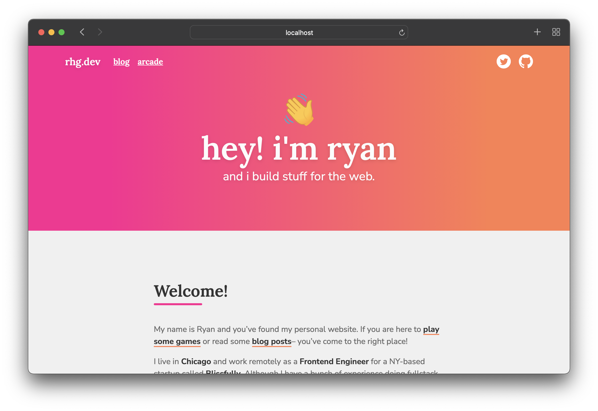

# @ryannhg/rhg-dev
> My personal website, built with [Hugo](https://gohugo.io/)



### running locally

1. Install `hugo` from [Hugo](https://gohugo.io/)
2. Run `hugo server -D` to start a server at [http://localhost:1313](http://localhost:1313)


### adding content to the site

1. Run `hugo new blog/<name-of-post>.md` to create a new blog post
1. Run `hugo new arcade/<name-of-post>.md` to create a new arcade entry


### dynamic banners

There's a special `scripts` folder that I use to take care of other build stuff, like __generating SEO preview images__ for sharing on Twitter.

The command for running this is:

```
cd scripts/seo-image-gen
go run main.go
```

This script requires all images to be 128x128 pixels, and will warn you if the size is anything else. (Rather than generating an invalid image!)

### found a typo?

If you find a typo in one of my blog posts, you can find the corresponding markdown file in the `content/*` folder.

For example, a typo at `https://rhg.dev/blog/hello-world` can be found in the file `./content/blog/hello-world.md`

( I'm more than happy to fix spelling errors, so PRs are welcome! )