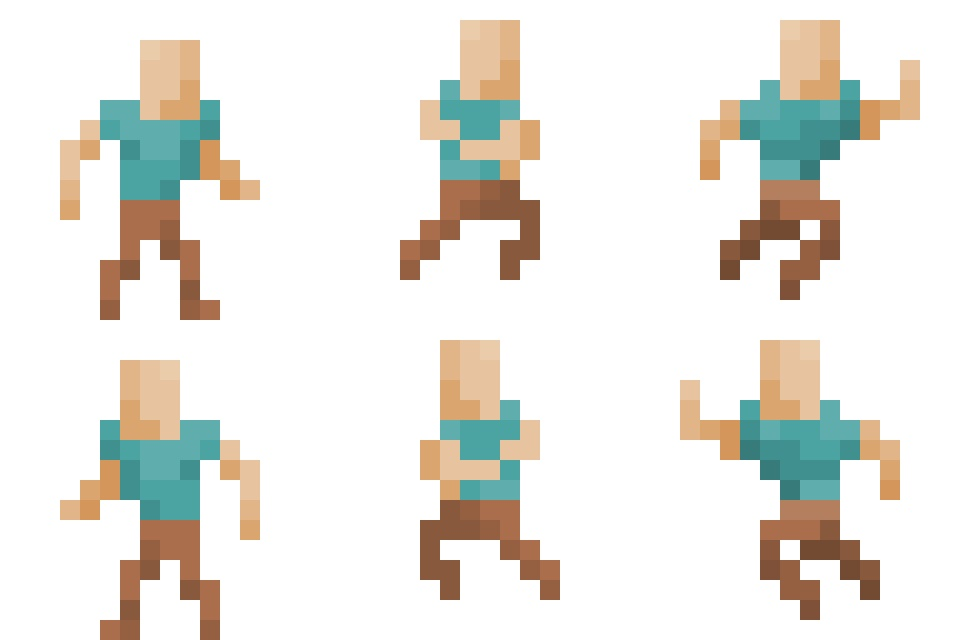

### Introduction

I wanted to make an RPG in Elm, so I got started making simple prototypes like this:

It's pretty fun building games in Elm, because the compiler is so freaking chill.

Play it in fullscreen over here: [https://elm-canvas-demo.netlify.com](https://elm-canvas-demo.netlify.com)

This post is just a breakdown of some of the stuff I added in.

### Terrain generation

I was playing around with simple terrain generation for [another project](https://github.com/ryannhg/elm-terrain-generator). It uses a simple algorithm that just plants forests, water, and villages randomly.

I still need to connect them with roads and make houses, and all that fun stuff later!

I _love_ the idea of generating the game world with code, that way it's a new experience everytime. Also, as the game designer, I don't know all the secret places!

If I handcrafted the world myself, nothing would be a surprise!

You can play around with the seed value to make a new world.

### Three ways to do input

Initially, this only worked on the keyboard using WASD controls. But everytime I would share a link with my friends, we'd be out somewhere, away from keyboards...

For that reason, I added a simple touch control system so my pals could run around by dragging on the screens of their phones.

In the long term, I don't have a plan to continue with mobile gameplay, but it's fun for now! 😄

#### Gamepad support

I recently figured out how to support the Gamepad API in Elm [in another experiment](https://github.com/ryannhg/elm-gamepad-demo).

It's not a lot of code to get working, but it is so rewarding sitting back on the couch and running around with an Xbox 360 controller in the game world.

My buddy Nick commented on how it would be nice if the terrain generation worked with the controller, so now tapping `A` will spawn a new world.

If you have a gamepad, feel free to try it out!

### The player animation

Another cool thing, is that the character animation only required three unique images.



The reason the spritesheet has 6 images, is that it's more performant for me to generate the flipped versions once instead of flip them dynamically once the game is running!

#### How does it work?

for now, I'm just describing what column in the spritesheet to grab for each frame.

```elm
playerRunAnimation : Array Int
playerRunAnimation =
    -- Should have 60 elements
    Array.fromList <|
        List.concat
            [ List.repeat 6 0
            , List.repeat 9 1
            , List.repeat 6 0
            , List.repeat 9 2
            , List.repeat 6 0
            , List.repeat 9 1
            , List.repeat 6 0
            , List.repeat 9 2
            ]
```

Expanded out, it's just a list like this:

```json
[ 0, 0, 0, 0, 0, 0
, 1, 1, 1, 1, 1, 1, 1, 1, 1
, 0, 0, 0, 0, 0, 0
, 2, 2, 2, 2, 2, 2, 2, 2, 2
, 0, 0, 0, 0, 0, 0
, 1, 1, 1, 1, 1, 1, 1, 1, 1
, 0, 0, 0, 0, 0, 0
, 2, 2, 2, 2, 2, 2, 2, 2, 2
]
```

As you can see, the 2nd and 3rd columns (index 1 and 2) are a bit longer. That's to give the effect that the player is in the air longer, like he's taking a bigger stride!

### Wanna check it out?

Or checkout the source code in this repo: [https://github.com/ryannhg/elm-canvas-things](https://github.com/ryannhg/elm-canvas-things)
